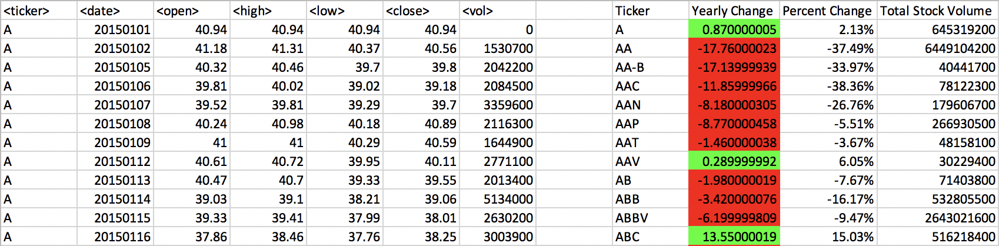

# HW2 Easy Solution
Sub StockA()

    For Each ws In Worksheets
        Dim Total_stock_volume As Double
        Total_stock_volume = 0
        Dim ticker As String
        Dim summary_table_row As Integer
        summary_table_row = 2
       
        last_row = ws.Cells(Rows.Count, 1).End(xlUp).Row
        
        ws.Range("I1").Value = "ticker"
        ws.Range("J1").Value = "total_stock_volume"

        For i = 2 To last_row
        
               If ws.Cells(i , 1).Value <> ws.Cells(i+1, 1).Value Then

                     ticker = ws.Cells(i, 1).Value
               
                    Total_stock_volume = Total_stock_volume + ws.Cells(i, 7).Value
               
                    ws.Range("I" & summary_table_row)= ticker
                    ws.Range("J" & summary_table_row)= Total_stock_volume
                    summary_table_row = summary_table_row + 1
                    Total_stock_volume = 0

             Else

                    Total_stock_volume = Total_stock_volume + ws.Cells(i, 7).Value

             End If

     Next i

  Next
  
End Sub

# Unit 2 | Assignment - The VBA of Wall Street

## Background

You are well on your way to becoming a programmer and Excel master! In this homework assignment you will use VBA scripting to analyze real stock market data. Depending on your comfort level with VBA, choose your assignment from Easy, Moderate, or Hard below.

### Files

* [Test Data](Resources/alphabtical_testing.xlsx) - Use this while developing your scripts.

* [Stock Data](Resources/Multiple_year_stock_data.xlsx) - Run your scripts on this data to generate the final homework report.

### Stock market analyst

### Easy

* Create a script that will loop through each year of stock data and grab the total amount of volume each stock had over the year.

* You will also need to display the ticker symbol to coincide with the total volume.

* Your result should look as follows (note: all solution images are for 2015 data).

### Moderate

* Create a script that will loop through all the stocks and take the following info.

  * Yearly change from what the stock opened the year at to what the closing price was.

  * The percent change from the what it opened the year at to what it closed.

  * The total Volume of the stock

  * Ticker symbol

* You should also have conditional formatting that will highlight positive change in green and negative change in red.

* The result should look as follows.

### Hard

* Your solution will include everything from the moderate challenge.

* Your solution will also be able to locate the stock with the "Greatest % increase", "Greatest % Decrease" and "Greatest total volume".

* Solution will look as follows.

### CHALLENGE

* Make the appropriate adjustments to your script that will allow it to run on every worksheet just by running it once.

* This can be applied to any of the difficulties.

### Other Considerations

* Use the sheet `alphabetical_testing.xlsx` while developing your code. This dataset is smaller and will allow you to test faster. Your code should run on this file in less than 3-5 minutes.

* Make sure that the script acts the same on each sheet. The joy of VBA is to take the tediousness out of repetitive task and run over and over again with a click of the button.

## Submission

* To submit please save the following in the same folder to <https://www.dropbox.com/>.

  * A screen shot for each year of your results on the Multi Year Stock Data.

  * VBA Scripts as separate files.

* After everything has been saved, create a sharable link and submit that to <https://bootcampspot-v2.com/>.

- - -

### Copyright

Coding Boot Camp © 2018. All Rights Reserved.

